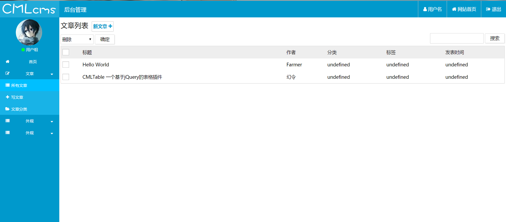

# CMLTable

基于jQuery编写

## 引用
```
    <link rel="stylesheet" href="cmltable/cmltable.css" />
    <script src="js/jquery-3.1.1.min.js"></script>
```

## 创建
```
$('#test').createCMLTable({
    url:'http://127.0.0.1/controller.php',
    action:[{
        action:'delete',
        title:'删除'
    },{
        action:'absdelete',
        title:'永久删除'
    }
    ],
    columns: [{
        checkbox: true
    }, {
        field: 'uid',
        title: 'UID',
    },{
        field:'user',
        title:'用户名'
    }]
});
```

